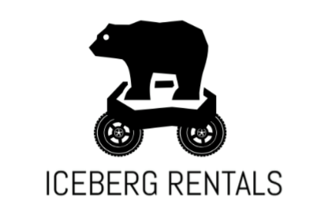

>
## **T-113-VLN1, Verklegt námskeið 1, 2018-3**

## **Table of contents**
1. Introduction
2. Data
3. Video
4. Authors

## **1. Introduction**
This program is a car rental booking system that allows the car rental company to easily create and manage bookings in addition to keep the car fleet updated. The system has two paths, admin and dealer, where the admin has its own actions and dealer has another. The admin is the controller, the one who can manipulate the fleet (for example add a new car to the system or remove one). The dealer is the employee who interacts with the customer and therefore is the main user of the system. 
The goal of this system is to make every day work easier for those in the car rental business.  

## **2. Data**
The program uses two csv datasets, one named cars.csv and another named booking.csv.
You can find them [here](https://github.com/margreta/car-rental/tree/master/Iceberg_classes/data)

_**Cars.csv**_ contains information about all registered cars: 

License plate | *Type | Price | Status 
--------------|------|-------|--------
OFS45|A|4000|Available
SDE44|B|3000|Rented 

*The type referest to the category the car belongs to (A,B or C) and the type determines the price.

_**booking.csv**_ contains information about the customer who has ever made a reservation with the company: 

Name | Drivers license | Email | Phone number | *Credit card information | Starting date | End date | License plate | type | price | Extras | Billing type | Booking status  
-----|-----------------|-------|--------------|-------------------------|---------------|----------|---------------|------|-------|--------|--------------|---------------
Anna Valdís Einarsdóttir|123436|annacool@gmail.com|898-0032|"4543-8433-4324-2342, 02/18, 233|2/3/2018|5/3/2018|OFD73|A|4000|car seat|debit card|New
Sigga Herdís Guðmundsdóttir|123246|siggacool@gmail.com|432-4322|"4232-2342-3478-8764, 05/29, 343|10/10/2018|15/10/2018|KSA55|B|3000|kasko insurance|cash|Cancelled

*In credit card information you can see the credit card number along with the validation time and the cvc number. 

This system allows the user to look up specific data to find in each of those datasets. For example if the employee needs to check status of some car he can look it up by its license plate number and all information regarding that specific car will show up on the screen. Also if employee needs to look up specific customer he can simply do so by entering the customers email and all information regarding that customer will show up on the screen. 

## **3. Video**
This video below is an introduction to the program and it's functions

## **4. Authors**
- Anna Valdís Einarsdóttir - BSc in Business Administration with a minor in Computer Science
- Arna María Ólafsdóttir - BSc in Business Administration with a minor in Computer Science
- Margrét Anna Ágústsdóttir - BSc Computer Science
- Sara Brynjólfsdóttir - BSc in Business Administration with a minor in Computer Science
- Sigríður Herdís Guðmundsdóttir - BSc in Business Administration with a minor in Computer Science

## **5. Installation**
The system runs on Python.\
First you have to sign in as “Admin” or “Dealer”, depending on what you are going to do.
The username for the Admin log-in is “admin” and no specific password, and “dealer” and no specific password for the Dealer log-in.

 
