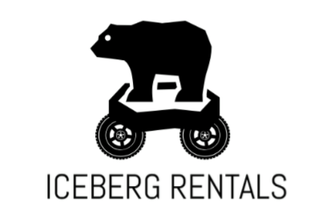

>
## **T-113-VLN1, Verklegt námskeið 1, 2018-3**

## **Table of contents**
1. Introduction
2. Data
3. Video
4. Authors

## **1. Introduction**
This program is a car rental booking system that allows the car rental company to easily create and manage bookings in addition to keep the car fleet updated. The system has two paths, admin and dealer, where the admin has its own actions and dealer has another. The admin is the controller, the one who can manipulate the fleet (for example add a new car to the system or remove one). The dealer is the employee who interacts with the customer and therefore is the main user of the system. 

## **2. Data**
The program uses two csv datasets, one named cars.csv and another named booking.csv.
You can find them here: (https://github.com/margreta/car-rental/tree/master/Iceberg_classes/data)

Cars.csv contains information about all registered cars. The informations are the license plate number, type of the car, the price per day and if the car is available, rented or unavailable. In the system you can look up the car by the license plate number.

Booking.csv contains personal information about the customer and what car it has rentend. In the system you can look up customer by its email. 

## **3. Video**
This video below is an introduction to the program and it's functions

## **4. Authors**
- Anna Valdís Einarsdóttir - BSc in Business Administration with a minor in Computer Science
- Arna María Ólafsdóttir - BSc in Business Administration with a minor in Computer Science
- Margrét Anna Ágústsdóttir - BSc Computer Science
- Sara Brynjólfsdóttir - BSc in Business Administration with a minor in Computer Science
- Sigríður Herdís Guðmundsdóttir - BSc in Business Administration with a minor in Computer Science

 
